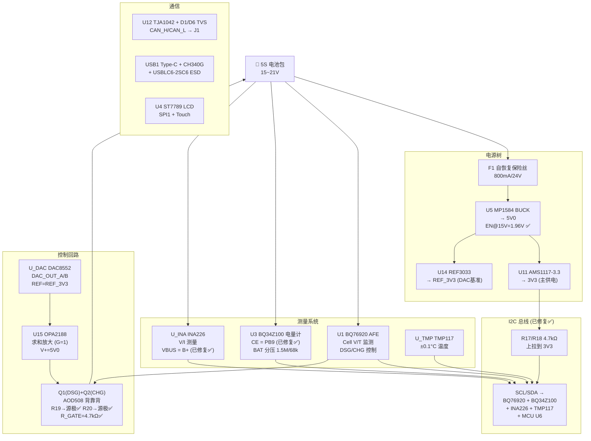

# BMS-5S 电路修改拓扑图 (修正版)

## 网络级修改拓扑

```mermaid
flowchart LR
    subgraph F1["F1: BQ34Z100 CE 连接修复"]
        direction LR
        OLD_F1["❌ 修改前<br/>PB9 = {U3.2}<br/>PB9_BQ34_VEN = {U6.29}<br/>└─ 两个网络未连通"]
        NEW_F1["✅ 修改后<br/>PB9_BQ34_VEN = {U3.2, U6.29}<br/>└─ 同一网络, CE 由 MCU 控制"]
        OLD_F1 -->|"合并网络: 删除 PB9,<br/>U3.2 加入 PB9_BQ34_VEN"| NEW_F1
    end

    subgraph F2["F2: INA226 VBUS 连接"]
        direction LR
        OLD_F2["❌ 修改前<br/>U_INA.8 悬空 (不在任何网络)<br/>└─ 无法测功率"]
        NEW_F2["✅ 修改后<br/>B+ = {..., U_INA.8}<br/>└─ VBUS 接入 B+"]
        OLD_F2 -->|"U_INA.8 加入 B+ 网络"| NEW_F2
    end

    subgraph F3["F3: MP1584 EN 分压修正"]
        direction LR
        OLD_F3["❌ 修改前<br/>B+ → 100kΩ → EN → 10kΩ → GND<br/>EN@15V = 1.36V < 1.50V"]
        NEW_F3["✅ 修改后<br/>B+ → 100kΩ → EN → 15kΩ → GND<br/>EN@15V = 1.96V > 1.50V"]
        OLD_F3 -->|"R_EN2_U7: 10kΩ→15kΩ"| NEW_F3
    end

    subgraph S1["S1: I2C 上拉电源修正"]
        direction LR
        OLD_S1["❌ 修改前<br/>R17.1 → BQ_3V3<br/>R18.1 → BQ_3V3<br/>└─ 上拉与器件电源异源"]
        NEW_S1["✅ 修改后<br/>R17.1 → 3V3<br/>R18.1 → 3V3<br/>└─ 上拉与器件电源同源"]
        OLD_S1 -->|"R17.1/R18.1 从 BQ_3V3 移到 3V3"| NEW_S1
    end

    subgraph S2["S2: MOSFET 栅极电阻修正"]
        direction LR
        OLD_S2["❌ 修改前<br/>R19: DSG_GATE → $2N122(共漏)<br/>R20: CHG_GATE → $2N122(共漏)"]
        NEW_S2["✅ 修改后<br/>R19: DSG_GATE → SRN_INA(Q1源极)<br/>R20: CHG_GATE → PACK-(Q2源极)"]
        OLD_S2 -->|"R19.1→SRN_INA<br/>R20.1→PACK-"| NEW_S2
    end

    subgraph S3["S3: 栅极隔离电阻调整"]
        direction LR
        OLD_S3["❌ 修改前<br/>R_GATE_A = R_GATE_B = 1kΩ<br/>BQ-OPA 冲突电流 ~11mA"]
        NEW_S3["✅ 修改后<br/>R_GATE_A = R_GATE_B = 4.7kΩ<br/>BQ-OPA 冲突电流 ~2.3mA"]
        OLD_S3 -->|"1kΩ→4.7kΩ"| NEW_S3
    end

    subgraph S4["S4: Cell 滤波对称化"]
        direction LR
        OLD_S4["❌ 修改前<br/>C1 = 1μF, C2~C5 = 100nF<br/>VC1 τ=100μs, VC2 τ=10μs"]
        NEW_S4["✅ 修改后<br/>C1 = 100nF = C2~C5<br/>全部 τ=10μs 对称"]
        OLD_S4 -->|"C1: 1μF→100nF"| NEW_S4
    end

    F1 --> F2 --> F3 --> S1 --> S2 --> S3 --> S4
```



---

## 网络变更详细对照

```
═══════════════════════════════════════════════════════════════════
修改        网络名           修改前成员              修改后成员
═══════════════════════════════════════════════════════════════════
F1    PB9              {U3.2}                 ✕ 删除此网络
      PB9_BQ34_VEN     {U6.29}               {U6.29, U3.2}

F2    B+               {Cin_U7.1, F1.2,      {Cin_U7.1, F1.2,
                        R8.1, R22.2,          R8.1, R22.2,
                        R_EN1_U7.2,           R_EN1_U7.2,
                        U5.7, U16.2}          U5.7, U16.2,
                                              U_INA.8}  ←新增

S1    BQ_3V3           {C9.2, R17.1,         {C9.2, U1.8}
                        R18.1, U1.8}
      3V3              {...原有...}           {...原有...,
                                              R17.1, R18.1} ←移入

S2    $2N122           {Q1.3, Q2.3,          {Q1.3, Q2.3}
                        R19.1, R20.1}
      SRN_INA          {Q1.2, R9_34.1,       {Q1.2, R9_34.1,
                        R9_76.1, R9_INA.1,    R9_76.1, R9_INA.1,
                        R_SRN_A.1,            R_SRN_A.1,
                        R_SRN_B.2,            R_SRN_B.2,
                        Rsns.2}               Rsns.2,
                                              R19.1}  ←新增
      PACK-            {Q2.2, U16.1}          {Q2.2, U16.1,
                                              R20.1}  ←新增
═══════════════════════════════════════════════════════════════════
```

---

## 元件值变更对照

```
═══════════════════════════════════════════════════════════════════
修改    位号          修改前            修改后            封装不变
═══════════════════════════════════════════════════════════════════
F3      R_EN2_U7      10kΩ              15kΩ             R0805
S3      R_GATE_A      1kΩ               4.7kΩ            R0805
S3      R_GATE_B      1kΩ               4.7kΩ            R0805
S4      C1            1μF               100nF            C0805
M1*     R19           10kΩ (栅→漏)      10kΩ (栅→源)     R0805_NEW
M1*     R20           10kΩ (栅→漏)      10kΩ (栅→源)     R0805_NEW
M3*     R_FREQ_U7     1MΩ               500kΩ            R0805
═══════════════════════════════════════════════════════════════════
* M1/M3 为改进项, 非必须
```

---

## 走线级修改示意图 (PCB 视图抽象)

```
  原 PCB 布局                              修改后布局
  
  U6 (MCU排针)                            U6 (MCU排针)
  ┌──────────┐                            ┌──────────┐
  │ Pin29 ─┐ │  PB9_BQ34_VEN              │ Pin29 ───│─┐ PB9_BQ34_VEN
  │         │ │   (未连到 U3)              │          │ │  ───→ U3.2
  └──────────┘ │                          └──────────┘ │
               │                                        │
  U3 (BQ34)    │         ──→            U3 (BQ34)       │
  ┌──────────┐ │                        ┌──────────┐   │
  │ Pin2 ─┐  │ │  PB9 (孤立!)            │ Pin2 ────│───┘
  │        │  │ │                        │          │
  └──────────┘ │ │                        └──────────┘
               │ │
  U_INA (INA226)│                        U_INA (INA226)
  ┌──────────┐ │                        ┌──────────┐
  │ Pin8 ─── │─┘ 悬空!                  │ Pin8 ────────→ B+ 网络
  └──────────┘                           └──────────┘
  
  R17/R18 (I2C上拉)                      R17/R18 (I2C上拉)
  ┌──────────┐                           ┌──────────┐
  │ 上拉端 ──│──→ BQ_3V3                 │ 上拉端 ──│──→ 3V3
  └──────────┘                           └──────────┘
  
  R19 (10kΩ)                             R19 (10kΩ)
  ┌──────────┐                           ┌──────────┐
  │ R19.1 ───│──→ Q1.3/Q2.3(共漏)        │ R19.1 ───│──→ SRN_INA(Q1源)
  └──────────┘                           └──────────┘
  
  R20 (10kΩ)                             R20 (10kΩ)
  ┌──────────┐                           ┌──────────┐
  │ R20.1 ───│──→ Q1.3/Q2.3(共漏)        │ R20.1 ───│──→ PACK-(Q2源)
  └──────────┘                           └──────────┘
```

---

## 修改后的完整系统拓扑



---

## 生成文件清单

| 文件 | 用途 |
|------|------|
| `Netlist_PCB1_2026-06-11_CORRECTED.tel` | **修正后的网表** — 可直接与原始 `.tel` diff 对比 |
| `review_mod_topology.md` | 修改拓扑 Mermaid 图 + 文字说明 (上一版) |
| `competition_plan_bms5s.md` | 竞赛方案 (四周计划) |

---

## 在立创 EDA 中应用修改

立创 EDA 无法直接导入 `.tel` 网表修改原理图，但可以通过以下方式操作：

1. **原理图修改 (推荐方式):**
   - 打开 `SCH_Schematic1_2026-05-19` 工程
   - 对照上方「网络变更详细对照」表逐项修改:
     - F1: 将 U3.2 的网络名从 `PB9` 改为 `PB9_BQ34_VEN`
     - F2: 将 U_INA.8 连接到 `B+` 网络
     - S1: 将 R17.1/R18.1 从 `BQ_3V3` 移到 `3V3`
     - S2: 将 R19.1 从共漏节点移到 `SRN_INA`; R20.1 移到 `PACK-`

2. **元件值修改:**
   - F3: R_EN2_U7: `10kΩ` → `15kΩ`
   - S3: R_GATE_A/R_GATE_B: `1kΩ` → `4.7kΩ`
   - S4: C1: `1μF` → `100nF`

3. **验证方法:**
   - 修改后导出新网表
   - 用 `diff` 对比新网表与 `Netlist_PCB1_2026-06-11_CORRECTED.tel`
   - 确认 F1~S4 的所有变更在新网表中体现
