# BMS-5S 电路修改拓扑图

```mermaid
flowchart TD
    START["🔍 审查发现的 10 个问题"] --> PHASE1

    subgraph PHASE1["🔴 第一阶段: 严重 (阻断性 — 必须先改)"]
        direction TB
        M1["① BQ34Z100 CE 悬空<br/>━━━━━━━━━━━━━━━━<br/>问题: U3.2 网络名 PB9<br/>U6.29 网络名 PB9_BQ34_VEN<br/>两个网络未连通<br/>━━━━━━━━━━━━━━━━<br/>修改: 将 U3.2 网络名改为<br/>PB9_BQ34_VEN 或 PCB 连线<br/>━━━━━━━━━━━━━━━━<br/>涉及: 1 条走线"]
        M2["② MP1584 EN 欠压<br/>━━━━━━━━━━━━━━━━<br/>问题: 5S 最低电压 15V 时<br/>EN = 15×10k/110k = 1.36V<br/>< 1.5V 阈值 → 不启动<br/>━━━━━━━━━━━━━━━━<br/>修改: R_EN2_U7 10kΩ → 15kΩ<br/>EN_min = 15×15k/115k = 1.96V ✅<br/>━━━━━━━━━━━━━━━━<br/>涉及: 换 1 颗电阻"]
        M3["③ INA226 VBUS 悬空<br/>━━━━━━━━━━━━━━━━<br/>问题: U_INA.8 未接任何网络<br/>无法测总线电压和功率<br/>━━━━━━━━━━━━━━━━<br/>修改: U_INA.8 → B+<br/>(经 100Ω+100nF 滤波)<br/>━━━━━━━━━━━━━━━━<br/>涉及: 1 条走线 + 1R+1C"]

        M1 --> M2 --> M3
    end

    PHASE1 --> PHASE2

    subgraph PHASE2["🟡 第二阶段: 中等 (影响可靠性)"]
        direction TB
        M4["④ I2C 上拉电源<br/>━━━━━━━━━━━━━━━━<br/>问题: 5 个 I2C 器件由主 3V3 供电<br/>但 R17/R18 上拉到 BQ_3V3<br/>BQ SHIP 模式时 I2C 失效<br/>━━━━━━━━━━━━━━━━<br/>修改: R17/R18 上拉改到主 3V3<br/>━━━━━━━━━━━━━━━━<br/>涉及: 2 颗电阻位置"]
        M5["⑤ MOSFET 栅极电阻<br/>━━━━━━━━━━━━━━━━<br/>问题: R19/R20 接 栅极→漏极<br/>非标准; 消耗 charge pump<br/>━━━━━━━━━━━━━━━━<br/>修改: 评估后改为<br/>栅极→源极 或 拆除<br/>━━━━━━━━━━━━━━━━<br/>涉及: 2 颗电阻"]
        M6["⑥ Cell 滤波对称化<br/>━━━━━━━━━━━━━━━━<br/>问题: C1=1μF vs C2~C5=100nF<br/>VC1 建立时间差 10 倍<br/>━━━━━━━━━━━━━━━━<br/>修改: C1 改为 100nF<br/>━━━━━━━━━━━━━━━━<br/>涉及: 1 颗电容"]

        M4 --> M5 --> M6
    end

    PHASE2 --> PHASE3

    subgraph PHASE3["🟢 第三阶段: 优化 (可选提升)"]
        direction TB
        M7["⑦ REF3033 输入滤波<br/>━━━━━━━━━━━━━━━━<br/>U14 输入端加<br/>100nF + 10μF 去耦"]
        M8["⑧ GND 分区<br/>━━━━━━━━━━━━━━━━<br/>大电流路径与<br/>信号 GND 分离"]
        M9["⑨ SPI 终端电阻<br/>━━━━━━━━━━━━━━━━<br/>SCK/MOSI 串 22Ω"]
        M10["⑩ BAT 电容<br/>━━━━━━━━━━━━━━━━<br/>C7 换更大封装<br/>减少 DC-bias 降额"]

        M7 --> M8 --> M9 --> M10
    end

    PHASE3 --> DONE["✅ 完成"]
```



---

## 修改依赖关系

```
修改顺序:  ① ──→ ② ──→ ③ ──→ ④ ──→ ⑤ ──→ ⑥ ──→ ⑦→⑧→⑨→⑩
           │      │      │      │      │      │      └─可选──┘
           │      │      │      │      │      │
依赖:      无     无     无     无     ⑤需   ⑥需
                                 评估   确认
                                 再改   电路
```

**①→②→③ 互相独立**，可以同时修改（不同电路区域），但建议按序验证。

**④ 依赖 ①**：因为 I2C 器件包括 BQ34Z100，需要先确认 BQ34 CE 正常才能验证 I2C 通信。

**⑤ 需要先评估**：确认 OPA2188 补偿网络的设计意图后再决定是否修改栅极电阻。

---

## 修改影响范围总览

```
┌─────────────────────────────────────────────────────────┐
│                    BMS-5S PCB 修改地图                     │
├────────────┬────────────┬──────────┬─────────────────────┤
│  修改编号   │  涉及元件    │  操作    │      影响电路块       │
├────────────┼────────────┼──────────┼─────────────────────┤
│   ① CE     │  U3, U6    │ 改网络名  │  BQ34Z100 电量计     │
│   ② EN     │  R_EN2_U7  │ 换电阻    │  MP1584 降压电源     │
│   ③ VBUS   │  U_INA     │ 加走线    │  INA226 电流检测     │
│   ④ I2C    │  R17, R18  │ 改连接    │  I2C 总线全部器件    │
│   ⑤ GATE   │  R19, R20  │ 改连接    │  MOSFET 充放电路     │
│   ⑥ CELL   │  C1        │ 换电容    │  BQ76920 Cell 采样   │
│   ⑦ REF    │  U14       │ 加电容    │  DAC8552 基准源      │
│   ⑧ GND    │  布局      │  布局调整  │  全局                │
│   ⑨ SPI    │  走线      │ 加电阻    │  LCD + DAC SPI      │
│   ⑩ BAT    │  C7        │ 换封装    │  BQ76920 供电        │
└────────────┴────────────┴──────────┴─────────────────────┘
```

---

## 修改前后对照

### 修改 ①: BQ34Z100 CE 连接

```
修改前:                     修改后:
┌──────┐                   ┌──────┐
│ U3.2 │── PB9 (悬空)       │ U3.2 │──┐
└──────┘                   └──────┘  │
                           ┌──────┐  │
│ U6.29│── PB9_BQ34_VEN    │ U6.29│──┤ PB9_BQ34_VEN
└──────┘                   └──────┘  │
                           (同一个网络)┘
```

### 修改 ②: MP1584 EN 分压

```
修改前:                     修改后:
B+ ──┬── 100kΩ ──┬── EN    B+ ──┬── 100kΩ ──┬── EN
     │           │               │           │
     │    R_EN2 10kΩ             │    R_EN2 15kΩ
     │           │               │           │
GND ─┴───────────┘         GND ─┴───────────┘

EN@15V = 1.36V ❌          EN@15V = 1.96V ✅
EN@21V = 1.91V ✅          EN@21V = 2.74V ✅ (safe < 6V abs max)
```

### 修改 ③: INA226 VBUS

```
修改前:                     修改后:
U_INA.8 (VBUS) → 悬空      U_INA.8 ── 100Ω ──┬── B+
                                              │
                                     100nF ──┴── GND
```

---

> 建议: Phase 1 三个修改一次性打板验证，Phase 2 在下一版修正，Phase 3 按需迭代。
